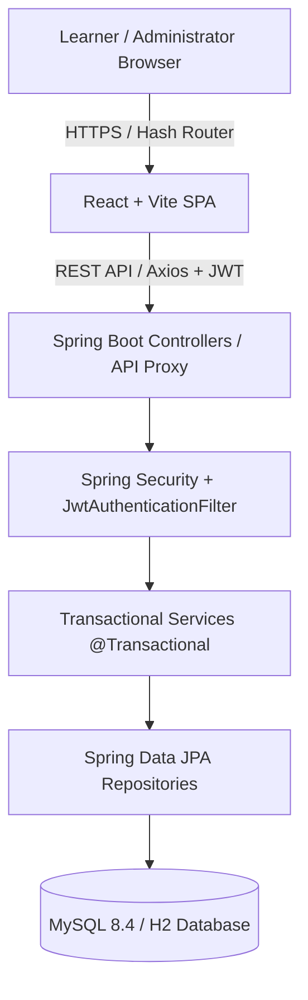

# QuizForge — Next-Gen Interactive Quiz & Assessment Platform

[](https://github.com/Jaswanth1502/QUIZ-APPLICATION/actions/workflows/deploy.yml)
[](https://jaswanth1502.github.io/QUIZ-APPLICATION/)
[](LICENSE)

QuizForge is a modern, full-stack, production-ready interactive quiz and assessment platform engineered for learners and administrators. It features real-time timed assessments, server-authoritative scoring, instant answer reviews, performance analytics, glassmorphic UI aesthetics, cascading relational deletion, and a secure administrator workspace.

🌐 **Live Deployment**: [https://jaswanth1502.github.io/QUIZ-APPLICATION/](https://jaswanth1502.github.io/QUIZ-APPLICATION/)  
📁 **GitHub Repository**: [https://github.com/Jaswanth1502/QUIZ-APPLICATION.git](https://github.com/Jaswanth1502/QUIZ-APPLICATION.git)

---

## 🌟 Key Features & Architecture Enhancements

### 🎯 Learner Experience
- **Public Entry & Authentication**: Opens unauthenticated to an intuitive public landing page (`/`). Users can register, log in, or explore published quizzes.
- **Unified Card & Glassmorphic UI**: Clean white cards (`#ffffff`) with smooth `1.25rem` (20px) rounded corners (`.card`), floating soft drop-shadows, and high-contrast typography.
- **Real-World Timed Quizzes**: Real-world multiple-choice assessments for Java, React, Spring Boot, MySQL, and General Knowledge with countdown timers and dynamic question navigators.
- **Server-Authoritative Scoring & Review**: Correct answers are validated on the server. Instant calculation of percentage, pass/fail result, and awarded marks, followed by detailed question-by-question explanations.
- **Synchronized User Analytics**: Learner Dashboard (`/dashboard`) metrics (*Completed Quizzes*, *Best Score*, *Average Score*, *Recent Activity*) and Quiz History (`/history`) correct answer ratios (*e.g., 4/4*) are computed dynamically from user attempt records with 100% mathematical precision.

### 🛡️ Administrator Workspace
- **Admin Authentication**: Dedicated admin sign-in mode with demo credential auto-fill (`admin` / `Admin@12345`).
- **Monitored Real-Data Growth Analytics**: Admin Dashboard line graphs scale dynamically and build monotonically to actual monitored active user counts without artificial drops or cliffs.
- **In-Place Category Management**: Create, edit, deduplicate, and update categories in-place without generating duplicate category rows.
- **Zero-Default Question Quiz Creator**: Creating a new quiz starts clean with 0 default questions (*"No questions assigned to this quiz yet"*) allowing admins to attach custom questions directly.
- **Auto-Inherited Category Pre-Selection**: When adding questions from a specific quiz context, the Category dropdown automatically pre-selects the inherited quiz category.
- **Cascading Question Bank Deletion**: Deleting questions from the Question Bank automatically removes join-table links before deleting the question, eliminating database foreign key conflicts.

---

## 🛠️ Technology Stack

| Layer | Technologies |
|---|---|
| **Frontend Framework** | React 18, Vite, TypeScript |
| **Styling & Aesthetics** | Custom Tailwind CSS, Lucide React Icons, Glassmorphism |
| **Form & State** | React Hook Form, React Router v6 |
| **HTTP Client & Mocking** | Axios (with JWT interceptors and fallback API simulation) |
| **Backend Framework** | Spring Boot 3.4, Java 21 |
| **Security & Auth** | Spring Security, JWT (JSON Web Tokens), BCrypt Password Hashing |
| **Persistence & Database** | Spring Data JPA, Hibernate, MySQL 8.4+ / H2 In-Memory DB |
| **CI/CD & Hosting** | GitHub Actions Workflow (`deploy.yml`), GitHub Pages |
| **Build & Tooling** | Maven 3.9+, Node.js 22+, Vitest, JUnit 5, Mockito |

---

## 📐 Architecture Overview



---

## 📁 Repository Structure

```text
QUIZ-APPLICATION/
├── .github/workflows/           # GitHub Actions CI/CD deployment pipeline (deploy.yml)
├── frontend/                    # React 18 + Vite + TypeScript Application
│   ├── src/
│   │   ├── api/                 # Axios client, interceptors, and API mock handlers
│   │   ├── components/          # Common UI components (Header, Footer, StatCard, Loading)
│   │   ├── context/             # AuthContext provider
│   │   ├── layouts/             # MainLayout, AdminLayout, AuthShell
│   │   ├── pages/               # Public, User (Dashboard, History), and Admin pages
│   │   ├── routes/              # Protected route guards (ProtectedRoute, AdminRoute)
│   │   └── types/               # TypeScript interface & type definitions
│   ├── package.json
│   └── vite.config.ts
├── backend/                     # Spring Boot 3.4 + Java 21 Backend Application
│   ├── src/main/java/com/quizapp/
│   │   ├── config/              # Security, DataInitializer, CORS configuration
│   │   ├── controller/          # REST Controllers (Auth, User, Quiz, Attempt, Admin)
│   │   ├── dto/                 # Request & Response DTO records
│   │   ├── entity/              # JPA Entities (User, Role, Quiz, Question, QuizAttempt, etc.)
│   │   ├── enums/               # AccountStatus, AttemptStatus, Difficulty, QuizStatus, ResultStatus
│   │   ├── repository/          # Spring Data JPA repositories
│   │   ├── security/            # JwtTokenProvider, JwtAuthenticationFilter, UserDetailsService
│   │   └── service/             # Business logic & admin operations
│   ├── src/main/resources/      # application.yml configuration
│   └── pom.xml
├── index.html                   # Repository root SPA entrypoint for GitHub Pages
├── 404.html                     # SPA fallback router for GitHub Pages
├── assets/                      # Production bundled CSS/JS assets
└── README.md
```

---

## 🔑 Demo Credentials

When auto-seeding is active (`app.seed.enabled=true`), the following pre-configured accounts are available:

| Role | Username | Password | Default Route |
|---|---|---|---|
| **Administrator** | `admin` | `Admin@12345` | `/admin` |
| **Learner (User)** | `alice` | `User@12345` | `/dashboard` |
| **Learner (User)** | `bob` | `User@12345` | `/dashboard` |

---

## 🚀 Quick Start & Setup Guide

### 1. Prerequisites
- **Java**: JDK 21 or higher
- **Node.js**: v18+ (Node 22 recommended) & npm
- **Maven**: 3.9+
- **MySQL**: 8.4+ (Optional - H2 in-memory DB is used by default if MySQL is not configured)

---

### 2. Backend Setup & Launch

1. Navigate to the backend directory:
   ```bash
   cd backend
   ```
2. Run Spring Boot dev server:
   ```bash
   mvn spring-boot:run
   ```
3. Backend service starts at: `http://localhost:8080`
   - Health check: `http://localhost:8080/actuator/health`

---

### 3. Frontend Setup & Launch

1. Open a new terminal and navigate to the frontend directory:
   ```bash
   cd frontend
   ```
2. Install dependencies:
   ```bash
   npm install
   ```
3. Start the Vite dev server:
   ```bash
   npm run dev
   ```
4. Access the web app in your browser: `http://localhost:5173`

---

## ⚙️ CI/CD & Deployment Workflow

Automatic build and deployment is configured via [.github/workflows/deploy.yml](.github/workflows/deploy.yml).

- On every push to `main`, GitHub Actions:
  1. Installs Node dependencies and builds the Vite frontend.
  2. Copies compiled bundle assets to both `gh-pages` branch and repository root.
  3. Deploys to GitHub Pages at **[https://jaswanth1502.github.io/QUIZ-APPLICATION/](https://jaswanth1502.github.io/QUIZ-APPLICATION/)**.

---

## 📄 License
This project is open-source and available under the [MIT License](LICENSE).
