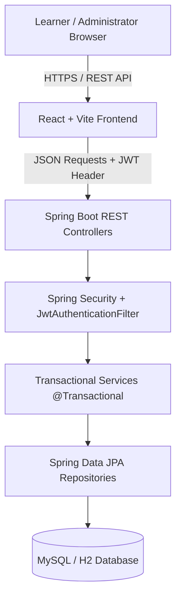

# QuizForge — Next-Gen Interactive Quiz Platform

QuizForge is a modern, full-stack, production-ready interactive quiz application designed for learners and administrators. It features real-time timed assessments, server-authoritative scoring, instant answer review, performance history analytics, glassmorphic UI aesthetics, and a secure administrator workspace.

---

## 🌟 Key Features & Recent Enhancements

### 🎯 Learner Experience
- **Unified Box & Card Architecture**: Clean white cards (`#ffffff`) with smooth `1.25rem` (20px) rounded corners (`.card`), subtle borders, floating soft drop-shadows, and comfortable internal padding.
- **Emerald Oasis & Academic Gold Aesthetics**: Signature warm mint-cream background (`#f7faf8`), deep obsidian titles (`#181c1b`), Academic Gold primary actions (`#D4AF37`), Sage Green accents (`#5B7564`), and high contrast typography.
- **Interactive Workflow Cards**: Step-by-step guidance cards on the home page with hover projections, active badges, and automatic mouseleave reset.
- **Registration to Sign-In Flow**: Creating an account seamlessly redirects to the Sign-In page (`/login`), displays a success notification banner (*"Account created successfully!"*), and pre-fills the username for quick authentication.
- **Real-World Timed Quizzes**: High-quality, real-world multiple-choice questions for Java, React, Spring Boot, MySQL, and General Knowledge with countdown timers and question navigators.
- **Server-Authoritative Timing & Scoring**: Correct answers are withheld during attempts and validated on the server. Instant calculation of percentage, pass/fail result, and awarded marks.
- **Answer Review & Explanations**: Detailed breakdown of every question after submission, showing user selections, correct answers, awarded marks, and technical explanations.
- **User Dashboard & Quiz History**: Personal statistics dashboard (completed quizzes, average score, best score, recent attempts) and full quiz history powered by transactional JPA queries.

### 🛡️ Administrator Workspace
- **Admin Sign-In Portal**: Integrated 1-click **"Sign in as Admin"** toggle on the Sign-In page with dedicated admin portal branding and a demo credential auto-fill helper (`admin` / `Admin@12345`).
- **Platform Analytics**: Comprehensive administrative dashboard displaying active user counts, total quizzes, attempt trends, and performance charts.
- **Category & Quiz Management**: Create, edit, publish, deactivate, or soft-delete categories and quizzes.
- **Question Bank Management**: Build question banks with at least four options and exactly one correct answer. Link/unlink questions to quizzes seamlessly.
- **User Account Management**: Monitor learner activities and activate/deactivate accounts.

---

## 🛠️ Technology Stack

| Layer | Technologies |
|---|---|
| **Frontend Framework** | React 18, Vite, TypeScript |
| **Styling & Icons** | Vanilla Tailwind CSS, Lucide React Icons |
| **Form Management** | React Hook Form |
| **Routing** | React Router v6 |
| **HTTP Client** | Axios (with token handling) |
| **Backend Framework** | Spring Boot 3.4, Java 21 |
| **Security & Auth** | Spring Security, JWT (JSON Web Tokens), BCrypt |
| **Persistence & Database** | Spring Data JPA, Hibernate, MySQL 8.4+ / H2 In-Memory DB |
| **Build & Tooling** | Maven 3.9+, Node.js 22+, Vitest, JUnit 5, Mockito |

---

## 📐 Architecture Overview



---

## 📁 Repository Structure

```text
QUIZ-APPLICATION/
├── frontend/                     # React Vite Frontend Application
│   ├── src/
│   │   ├── api/                  # Axios HTTP client configuration
│   │   ├── components/           # Common components (Header, Footer, StatCard, ErrorAlert, Loading)
│   │   ├── context/              # AuthContext provider
│   │   ├── layouts/              # MainLayout, AdminLayout, AuthShell
│   │   ├── pages/                # Public, User (Dashboard, History), and Admin pages
│   │   ├── routes/               # Protected route guards (ProtectedRoute, AdminRoute)
│   │   └── types/                # TypeScript interface & type definitions
│   ├── package.json
│   └── vite.config.ts
├── backend/                      # Spring Boot Backend Application
│   ├── src/main/java/com/quizapp/
│   │   ├── config/               # Security, DataInitializer, CORS configuration
│   │   ├── controller/           # REST endpoints (Auth, User, Quiz, Attempt, Admin)
│   │   ├── dto/                  # Request & Response DTO records
│   │   ├── entity/               # JPA Entities (User, Role, Quiz, Question, QuizAttempt, etc.)
│   │   ├── enums/                # AccountStatus, AttemptStatus, Difficulty, QuizStatus, ResultStatus
│   │   ├── exception/            # Custom ApiException & GlobalExceptionHandler
│   │   ├── repository/           # Spring Data JPA interfaces
│   │   ├── security/             # JwtTokenProvider, JwtAuthenticationFilter, UserDetailsService
│   │   └── service/              # Core business logic services
│   ├── src/main/resources/       # application.yml configuration
│   └── pom.xml
├── database/                     # SQL DDL schemas and seed scripts
├── docs/                         # Architecture, API specifications, and database docs
└── README.md
```

---

## 🔑 Demo Credentials

When auto-seeding is active (`app.seed.enabled=true`), the following pre-configured accounts are seeded:

| Role | Username | Password | Default Route |
|---|---|---|---|
| **Administrator** | `admin` | `Admin@12345` | `/admin` |
| **Learner (User)** | `alice` | `User@12345` | `/dashboard` |
| **Learner (User)** | `bob` | `User@12345` | `/dashboard` |

> *Note: On the Sign-In page, click **"Sign in as Admin"** to access the Admin Portal mode with 1-click credential auto-fill.*

---

## 🚀 Quick Start & Setup Guide

### 1. Prerequisites
- **Java**: JDK 21 or higher
- **Node.js**: v18+ (Node 22 recommended) & npm
- **Maven**: 3.9+
- **MySQL**: 8.4+ (Optional - H2 in-memory DB is used by default if MySQL is not configured)

---

### 2. Backend Setup & Launch

1. Navigate to the backend directory:
   ```bash
   cd backend
   ```
2. Run Spring Boot dev server:
   ```bash
   mvn spring-boot:run
   ```
3. Backend service starts at: `http://localhost:8080`
   - Health check: `http://localhost:8080/actuator/health`

---

### 3. Frontend Setup & Launch

1. Open a new terminal and navigate to the frontend directory:
   ```bash
   cd frontend
   ```
2. Install dependencies:
   ```bash
   npm install
   ```
3. Start the Vite dev server:
   ```bash
   npm run dev
   ```
4. Access the web app in your browser: `http://localhost:5173`

---

## 🧪 Testing & Verification

### Backend Unit & Integration Tests
```bash
cd backend
mvn test
```

### Frontend Vitest & Production Build
```bash
cd frontend
npm test -- --run
npm run build
```

---

## 📄 License
This project is open-source and available under the [MIT License](LICENSE).
