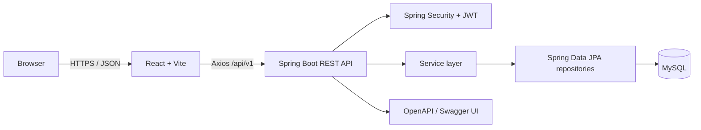

# System architecture

QuizForge is split into independently buildable frontend and backend applications. The React client communicates only through versioned REST endpoints. Spring Boot owns authentication, authorization, business rules, and persistence. MySQL stores durable application and attempt history.

## Backend layers

- `controller`: HTTP mapping, status codes, validation entry points
- `dto`: request and response contracts; entities are not exposed
- `service`: transactional business logic and authorization checks
- `repository`: JPA queries and pagination
- `entity`: normalized persistence model
- `security`: token parsing, authentication filter, user details
- `exception`: consistent consumer-safe API errors
- `config`: CORS, method security, OpenAPI, and development seed data

## Frontend structure

- `api`: Axios instance and refresh handling
- `context`: authentication state
- `routes`: protected and administrator guards
- `components`: reusable interface elements
- `pages/public`: marketing, catalogue, and authentication
- `pages/user`: attempts, results, history, dashboard, profile
- `pages/admin`: management and reporting
- `types`: API-facing TypeScript models

## Trust boundaries

The client may suggest an answer selection, but the server verifies the attempt owner, quiz question membership, option membership, official deadline, and submission state. Scores are calculated in one server transaction.
