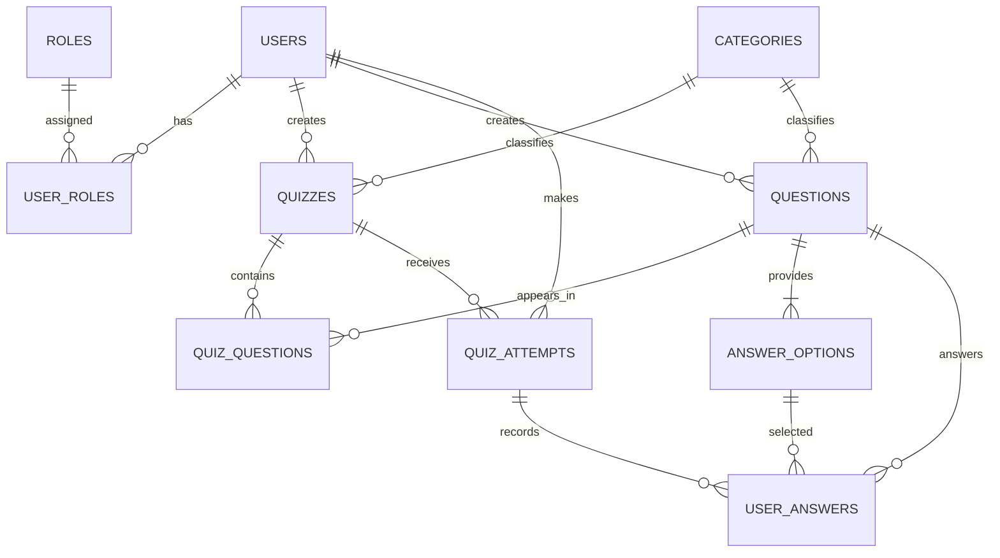

# Database design

The `database/schema.sql` script creates `quiz_application` and the normalized tables used by JPA.

## Integrity rules

- Unique username, email, role name, and category name
- Unique quiz/question and quiz/order pairs
- Unique answer option order per question
- Unique attempt/question answer
- Foreign keys preserve ownership and relationships
- Historical attempts reference quizzes without cascade deletion
- Quiz and category removal is implemented as status changes when history may exist
- Indexes support catalogue filtering, attempt history, and common administrative lookup paths

`database/seed-data.sql` initializes stable role names. The Spring `DataInitializer` creates password-hashed development accounts and realistic linked sample data because password hashes and entity relationships are safer to generate through application code.
